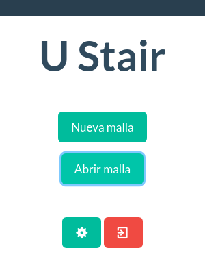
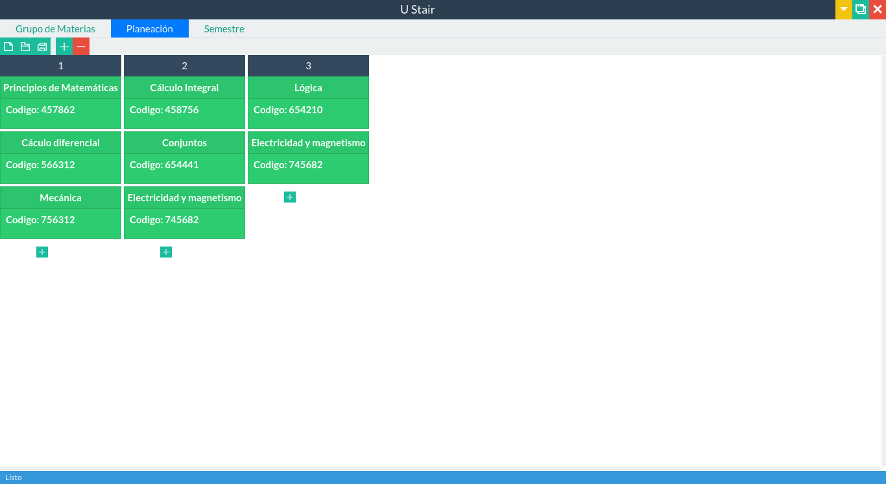
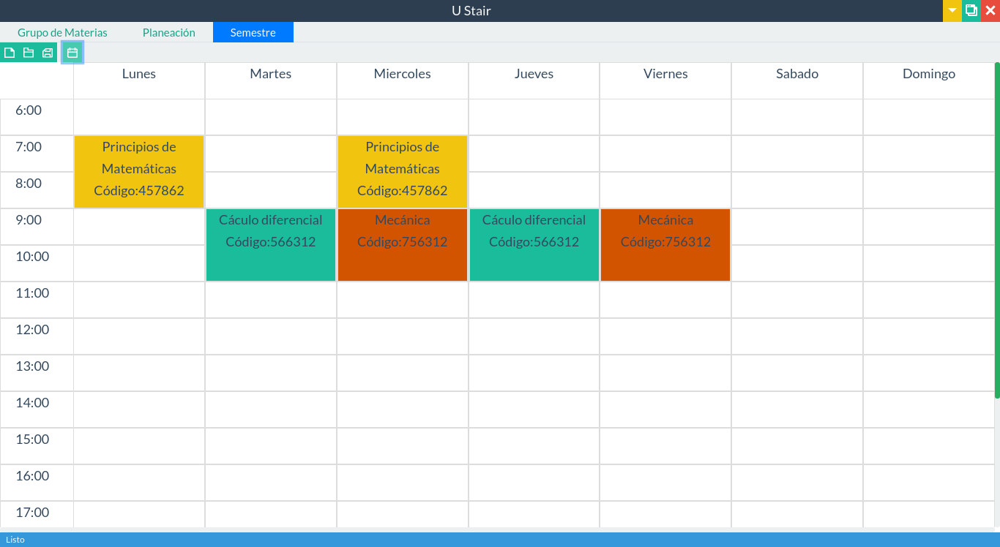

image:https://github.com/afmorenosa/U_Stair/workflows/Linux%20packaging/badge.svg[]
image:https://github.com/afmorenosa/U_Stair/workflows/Windows%20packaging/badge.svg[]

= U Stair

Application for organizing the curriculum for university programs.

== Screenshots

image::screenshots/subjects.png[]

== Web page

https://afmorenosa.github.io/U_Stair-WebPage/

== Usage

To see the usage, please refer to this
link:https://afmorenosa.github.io/U_Stair-WebPage/manual/[documentation page.]
